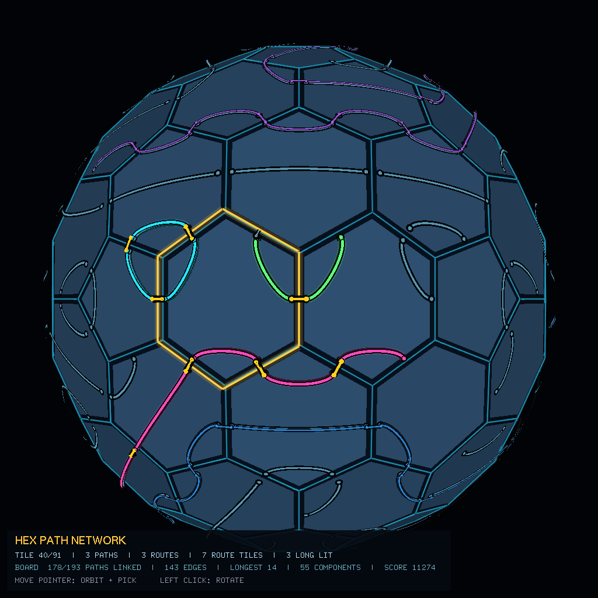
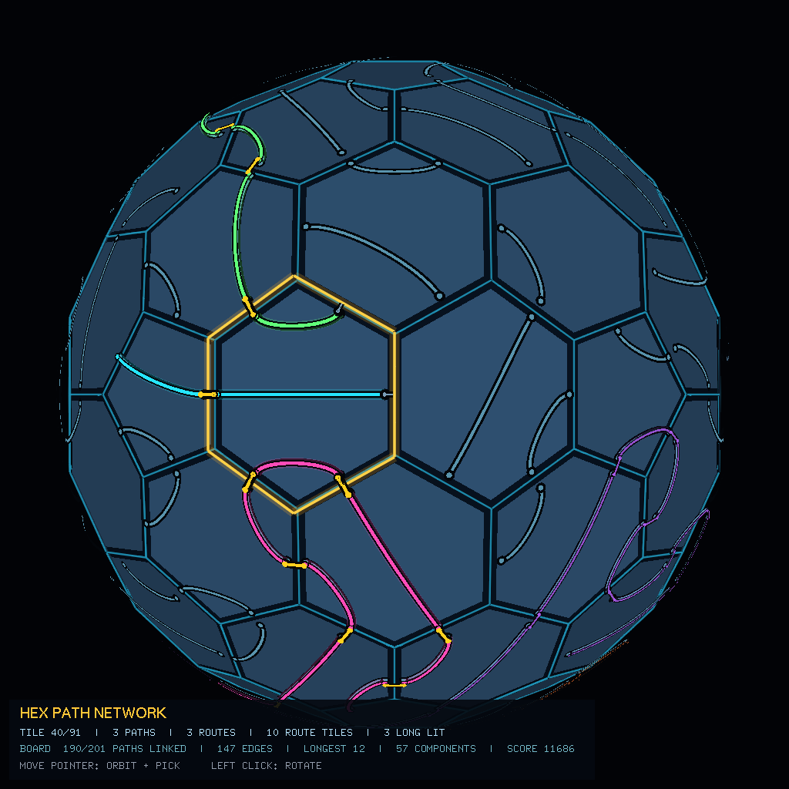

# HexPuzzle3D

HexPuzzle3D is an interactive route-building puzzle played across a spherical
mesh of pentagonal and hexagonal tiles. Rotate tiles to align compatible side
ports, join local paths into globe-spanning route components, and improve the
network score without ever merging or crossing independent paths.



_Seed `1`, subdivision level `2`. Muted violet and blue routes remain visible as
persistent long-route highlights. The selected tile is ringed in gold; its three
independent route components are overlaid in cyan, green, and magenta, with
yellow ribbons marking matched connections across tile boundaries._

## Game Synopsis

The planet is covered by rotatable puzzle tiles. Every tile contains one or more
independent paths, and every path connects exactly two sides of that tile. A
hexagon can contain one, two, or three simultaneous paths; each pentagonal
topology tile can contain one or two.

Your task is to rotate tiles so that a path endpoint meets another endpoint on
the neighboring tile. Matching endpoints create a connection across the shared
edge. Those local connections combine into longer chains or closed loops that
can travel around the planet.

The current build is an open-ended network-optimization puzzle rather than a
fixed-level game with a terminal win screen. The HUD provides the measurable
goals:

- connect more tile-local paths;
- create more matched cross-tile edges;
- extend the longest route component;
- reduce isolated paths and unnecessary route components;
- increase the overall board score.

The three longest qualifying routes remain highlighted even when the pointer
moves elsewhere, making large-scale progress visible while you inspect and
rotate other tiles.

## Quick Start

Install the dependencies, build the application, and launch a reproducible
board:

```bash
sudo apt-get update
sudo apt-get install build-essential pkg-config freeglut3-dev libimath-dev libpng-dev cmake xvfb

make
./hexp_main --seed 1 --assets . --subdivisions 2
```

Move the pointer over the planet to select tiles. Move it away from the window
center to orbit. Left-click to rotate the currently selected tile by one side.

## Core Rules

### Binary paths

Every tile-local path is a binary connection between exactly two sides. A path
has one entry side and one exit side; there are no three-way junctions, shared
ports, or intersections between concurrent paths.

The path geometry follows the tile surface:

- curved paths enter and leave their side edges perpendicularly;
- a path remains straight only when one surface line is perpendicular to both
  endpoint sides;
- paths do not need to pass through the tile center;
- separate paths on the same tile never interact.

### One, two, or three concurrent paths

A single hexagon may carry up to three path pairs at once. Rotating the tile
moves every path endpoint together while preserving the tile's internal pairing.
This creates a larger decision space than a one-connector tile: improving one
route may break another route on the same tile.

### Cross-tile connections

Two neighboring sides connect only when both sides contain a port. The route
continues into the unique path that owns the adjacent port. Because ports are
exclusive and paths are binary, route components remain non-branching chains or
loops.

### Persistent long routes

The board ranks route components by the number of tile-local path segments they
contain. Up to three routes containing at least four segments are rendered as a
muted persistent layer:

1. violet for the longest route;
2. blue for the second-longest route;
3. orange for the third-longest route.

Selected routes are rendered more brightly above this layer, so local inspection
never hides the board's long-term structure.

## Visual Guide

| Visual element | Meaning |
| --- | --- |
| Dark navy panel | A puzzle tile on the spherical board |
| Dim blue-gray ribbon | A tile-local path that is not currently emphasized |
| Cyan tile rim | The tile has at least one matched connection |
| Violet, blue, or orange route | One of the three persistent longest routes |
| Cyan, magenta, or green route | A distinct route component passing through the selected tile |
| Yellow cross-edge ribbon | A matched selected-route connection between neighboring tiles |
| Gold polygon ring | The currently selected tile |
| Small endpoint disc | A side port owned by one binary path |



_Seed `7`, subdivision level `2`. The selected tile contains three independent
paths. The bright selected-route overlay remains separate while longer persistent
routes continue around the visible hemisphere._

## Detailed Gameplay Walkthrough

### 1. Start with a reproducible board

Use `--seed` while learning the game so the same connector layouts, rotations,
and candidate board are regenerated each time:

```bash
./hexp_main --seed 7 --assets . --subdivisions 2
```

Subdivision level `2` is useful for inspection because the tiles and HUD remain
large. Higher levels create a denser planet with more paths and route components.

### 2. Read the persistent network first

Before rotating anything, look for the muted violet, blue, and orange routes.
These are the strongest current route components and remain visible regardless
of selection. Their colors provide stable landmarks while the camera moves.

The HUD's `LONGEST` value reports the segment count of the strongest component.
`LONG LIT` reports how many qualifying persistent routes are currently displayed.

### 3. Select a tile

Move the pointer over a visible tile. Selection uses an eye-space ray tested
against the rendered polygon, so the chosen tile follows the visible boundary
rather than an approximate center point. Moving outside the planet clears the
selection instead of leaving a stale tile active.

The selected tile receives a gold outline. Its path count and route information
appear on the first HUD status row.

### 4. Inspect every path on the tile

A selected tile may contain multiple independent paths. Follow each bright color
from one endpoint to its paired endpoint:

- cyan identifies the first selected route component;
- magenta identifies the second;
- green identifies the third.

Two paths can bend around one another without crossing, and none is implicitly
connected merely because the curves come close.

### 5. Check the side ports

At each endpoint, inspect the neighboring tile across the side. A connection
exists only when the neighboring side also owns a port. For the selected route,
a successful connection is drawn as a yellow cased ribbon crossing the shared
edge.

Unmatched endpoints stop at the tile boundary. They can become connected only
through rotation of this tile or its neighbor.

### 6. Rotate once and reevaluate

Left-click to rotate the selected tile by one side: `60` degrees for a hexagon or
`72` degrees for a pentagon. Every path pair rotates together.

After the rotation, the board immediately recomputes:

- active tile state;
- matched sides and connected edges;
- complete route components;
- persistent long-route ranking;
- longest-route length and board score.

A locally appealing connection is not always globally beneficial. Compare the
HUD before and after the move, and watch whether the persistent routes grow,
shrink, split, or disappear.

### 7. Build around the strongest route

A practical strategy is to extend the violet longest route without destroying
the blue and orange routes. Work at exposed endpoints, rotate nearby tiles to
continue the chain, and avoid sacrificing several existing edges for one short
connection.

Because a multi-path tile rotates all of its paths together, strong moves often
improve two routes simultaneously. Difficult moves require deciding which route
should remain connected.

## HUD Walkthrough

The HUD is divided into selected-tile and whole-board information.

### Selected-tile row

| Field | Meaning |
| --- | --- |
| `TILE 40/91` | Selected tile ID and highest tile ID |
| `3 PATHS` | Number of independent path pairs on the selected tile |
| `3 ROUTES` | Distinct global route components represented by those paths |
| `7 ROUTE TILES` | Unique tiles reached by the selected route components |
| `3 LONG LIT` | Number of persistent long-route highlights currently visible |

### Board row

| Field | Meaning |
| --- | --- |
| `178/193 PATHS LINKED` | Tile-local paths with at least one externally connected endpoint |
| `143 EDGES` | Matched physical tile boundaries, counted once each |
| `LONGEST 14` | Segment count of the largest route component |
| `55 COMPONENTS` | Number of route components, including isolated paths |
| `SCORE 11274` | Current deterministic network-quality score |

The score is calculated as:

```text
connected edges * 64
+ connected paths * 12
+ longest route * 24
- isolated paths * 16
- route components * 2
```

The scoring model rewards connectivity and long routes while penalizing
fragmentation. It is also used during board generation to choose the strongest
candidate from the deterministic seeded candidate set.

## Controls

| Input | Action |
| --- | --- |
| Move pointer over planet | Pick the visible tile under the pointer |
| Move pointer away from center | Orbit the planet in that direction |
| Return pointer toward center | Slow and stop orbiting |
| Left-click | Rotate the selected tile by one side |
| Move pointer outside planet | Clear selection |
| Close window | Exit the application |

## Command-Line Options

```text
--seed N             reproduce planet and puzzle randomization
--assets PATH        load PNG assets from PATH
--subdivisions 0..5  choose mesh detail; the original used 4
--debug-log PATH     append structured JSONL diagnostics to PATH
--smoke-test         render one frame and exit for headless validation
```

Examples:

```bash
# Dense interactive board
./hexp_main --seed 42 --assets . --subdivisions 4

# Smaller reproducible walkthrough board
./hexp_main --seed 7 --assets . --subdivisions 2

# Headless graphics smoke test
xvfb-run -a ./hexp_main --seed 1 --assets . --subdivisions 2 --smoke-test

# Append lifecycle and camera diagnostics
./hexp_main --seed 1 --debug-log /tmp/hexpuzzle-debug.jsonl
```

## Connector Generation

Connector layouts come from exhaustive deterministic catalogs rather than
rejection sampling:

- pentagons have `20` non-empty noncrossing layouts: `10` one-path and `10`
  two-path layouts;
- hexagons have `50` non-empty noncrossing layouts: `15` one-path, `30` two-path,
  and `5` three-path layouts;
- no layout contains a void connector, shared endpoint, or crossing pair;
- generation balances path count and connector span before choosing a layout;
- the board evaluates `24` seeded candidates by default and retains the
  highest-scoring candidate.

The same seed and settings reproduce the same planet, tile layouts, rotations,
candidate selection, metrics, and route highlighting.

## Build and Test

### Make

```bash
make
make test
make check
```

### CMake

```bash
cmake -S . -B build -DBUILD_TESTING=ON
cmake --build build
ctest --test-dir build --output-on-failure
```

OpenGL, GLU, FreeGLUT, Imath, and libpng must expose `pkg-config` metadata.

The deterministic core tests cover topology, connector catalogs, binary path
ownership, noncrossing concurrent paths, perpendicular curve endpoints, exact
tile picking, route traversal, persistent long-route ranking, board metrics,
camera stability, repeat detection, and structured debug logging.

## Camera and Repeat Detection

Stationary orbit orientation uses a bounded second-order Adams-Bashforth design.
AB2 predicts a quaternion, normalization projects it back onto the rotation
group, and a contractive correction keeps the result within `1e-6` radians of an
independent phase-locked reference. Completed revolutions re-anchor the
orientation and integration history.

When a stationary off-center pointer reproduces a complete tile-selection cycle
twice, the HUD displays `REPEAT` and the debug log emits
`tile_sequence_repeat_started`. Moving the pointer or stopping the orbit resets
the sequence check.

The numerical model is documented in `docs/ORBIT_ERROR_BOUND_MODEL.md` and can be
reproduced with:

```bash
python3 tools/orbit_error_model.py
```

## Architecture

- `HexPlanet` owns the spherical mesh, topology, subdivision, polygons,
  side-normal curve geometry, nearest-tile queries, and exact ray intersections.
- `PuzzleBoard` owns every `PuzzleTile`, connector catalogs, candidate-board
  scoring, route traversal, persistent long-route selection, rotation, and
  connection state.
- `OrbitCamera` owns viewport, pointer, view, and selection-ray state.
- `BoundedAdamsBashforthOrbit` owns the projected AB2 predictor, independent
  phase reference, correction bound, and periodic re-anchors.
- `Texture2D` and `TextureLibrary` own OpenGL texture resources and PNG loading.
- `HexPuzzleRenderer` draws tiles, side-normal ribbons, persistent and selected
  route layers, cross-edge bridges, selection markers, and the HUD.
- `HexPuzzleApplication` owns the GLUT lifecycle and routes callbacks to one
  application instance.
- `DebugLog` appends structured lifecycle and camera diagnostics when enabled.

The core puzzle model has no OpenGL dependency. Raw owning pointers, fixed-size
application arrays, global application state, SOIL, and obsolete OpenEXR include
paths have been removed from the refactored implementation.

## Governed Rewrites

The object-oriented refactor was preceded by a read-only OURD provider preflight
and repository inspection bound to the original Git commit and filesystem
snapshot. The ownership mapping, behavior-preservation decisions, and fail-closed
model boundaries are recorded in `docs/OURD_REFACTOR.md`.

The visual and algorithmic rewrite also used OURD in read-only advisory mode.
Accepted recommendations, corrected model claims, provider evidence, and the
deterministic validation contract are recorded in
`docs/OURD_VISUAL_ALGORITHMIC_REWRITE.md`.

## License

See `LICENSE`. The repository retains its original
Attribution-NonCommercial-NoDerivatives 4.0 International license text.
